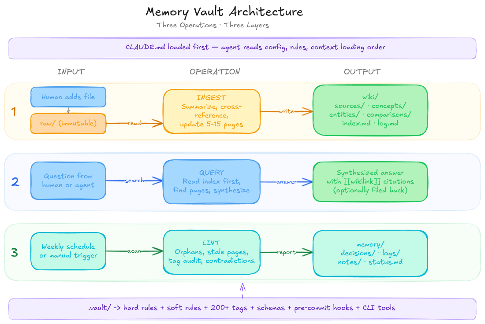
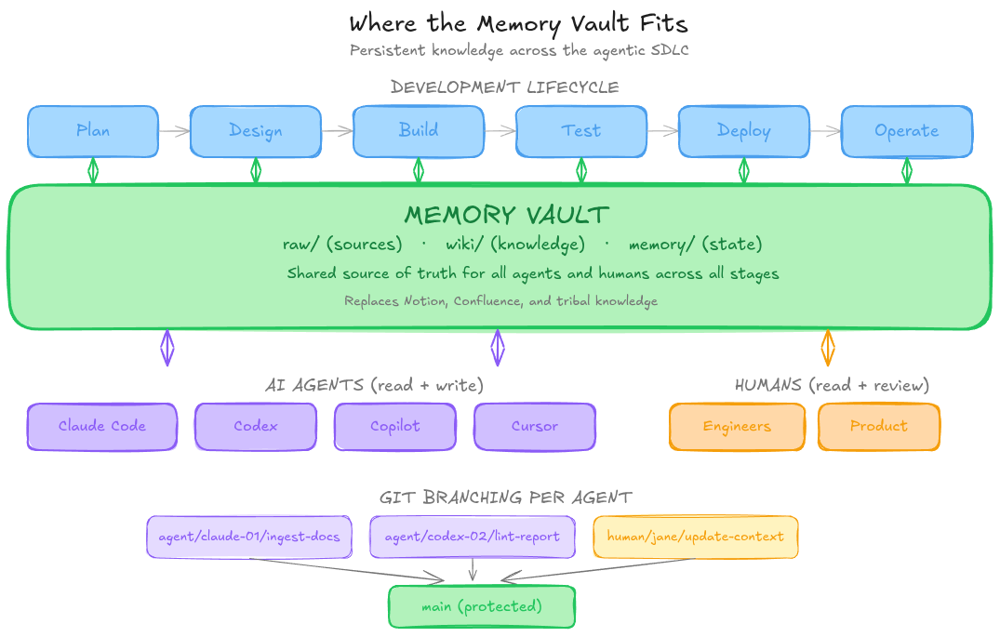

# Memory Vault Boilerplate

A structured, agent-first knowledge base template for organizations using AI agents alongside human teams.

[](LICENSE)


## What Is This



Memory Vault is a git-based knowledge management system designed for AI agents
(Claude Code, Codex, Copilot, Cursor) and human teams.
You clone this template, initialize it for your organization, and start building
institutional memory that both humans and agents can read, write, and reason over.

The architecture is inspired by the
[Karpathy LLM Wiki](https://gist.github.com/karpathy/442a6bf555914893e9891c11519de94f)
pattern, extended for multi-agent enterprise use.
Source documents go in, structured knowledge comes out.
Agents process sources into wiki pages, answer questions from the knowledge base,
and maintain vault health through automated linting.

No databases, no external services, no dependencies beyond bash and git. The vault is a directory of markdown files with YAML frontmatter, linked together with wikilinks, and governed by enforceable rules.

## Quick Start

```bash
# 1. Create your vault from the template
git clone https://github.com/galimba/agentic-memory-vault.git my-vault
cd my-vault

# 2. Run the initialization script
bash .vault/scripts/init.sh

# 3. Drop your first source document into raw/
cp ~/documents/q1-retro.md raw/

# 4. Tell your agent to ingest it
# In Claude Code: "Ingest the new file in raw/"

# 5. Run diagnostics to verify
bash .vault/scripts/vault-tools.sh doctor
```

## What's Included

```
raw/                  Immutable source documents (human-managed)
wiki/                 Agent-generated knowledge (agent-managed)
  sources/            Summaries of ingested documents
  entities/           Pages about people, companies, tools
  concepts/           Explanations of ideas, patterns, principles
  comparisons/        Side-by-side analyses
  index.md            Master catalog — agents read this first
  log.md              Append-only operations log
memory/               Operational state
  decisions/          Architecture and business decision records
  logs/               Agent session logs
  notes/              Running notes, lint reports
  status.md           Current vault health
.vault/               Configuration (human-managed)
  rules/              Hard rules, soft rules, tag taxonomy
  schemas/            Frontmatter and content schemas
  hooks/              Git pre-commit enforcement
  scripts/            CLI tools (lint, status, diagnostics)
templates/            Document templates for each content type
docs/                 Human documentation and guides
```

## How It Works



Agents perform exactly three operations on the vault:

**INGEST** — Process a new source document from `raw/` into structured wiki pages.
The agent reads the source, creates a summary in `wiki/sources/`, updates the index,
updates every materially affected concept/entity/comparison page, and logs the operation.
All generated pages include YAML frontmatter with tags, sources, and confidence levels.

**QUERY** — Answer questions using vault contents.
The agent reads `wiki/index.md` to find relevant pages,
synthesizes an answer with `[[wikilink]]` citations,
and optionally files the answer back as a new wiki page. Every query is logged.

**LINT** — Health-check the vault. Finds contradictions, orphan pages, stale content, invalid frontmatter, unapproved tags, and rule violations. Reports findings to `memory/notes/` and suggests improvements.

## Rules at a Glance

### Hard Rules (Enforced by Git Hooks)

| # | Rule | Threshold |
|---|------|-----------|
| HR-001 | Never modify files in `raw/` | Immutable |
| HR-002 | Every `wiki/` file needs valid YAML frontmatter | Required fields: title, type, created, updated, status, tags |
| HR-003 | Every `wiki/` file needs at least one approved tag | From `.vault/rules/tags.md` |
| HR-004 | Markdown files have a line limit | Warn 200, block 400 lines |
| HR-005 | Code files have a line limit | Warn 400, block 600 lines |
| HR-006 | Wiki page titles must be unique | Across all of `wiki/` |
| HR-007 | `updated` field must be accurate | ±1 day tolerance |
| HR-008 | Every `wiki/` file must be in the index | `wiki/index.md` |
| HR-009 | Tags use flat prefix notation | `prefix/value` only |
| HR-010 | Binary files go in `raw/` only | No binaries in `wiki/` or `memory/` |
| HR-011 | Vault configuration protected | `.vault/rules/`, `.vault/hooks/`, `.vault/scripts/` |
| HR-012 | Agent configuration protected | `CLAUDE.md`, `AGENTS.md`, `CODEX.md` |
| HR-013 | CI and templates protected | `.github/`, `templates/` |

### Soft Rules (Configurable Defaults)

| # | Rule | Default |
|---|------|---------|
| SR-001 | One source ingested at a time | Human review between |
| SR-002 | Target page length | 80-150 lines |
| SR-003 | Minimum wikilinks per page | 3 links |
| SR-004 | Source summary length | Word count tiers by source length |
| SR-005 | Log entry format | `## [DATE] operation \| Title` |
| SR-006 | Decision record format | ADR |
| SR-007 | Lint frequency | Weekly minimum |
| SR-008 | Staleness threshold | 30 days |
| SR-009 | Confidence calibration | high/medium/low/unverified |
| SR-010 | Review gates | Draft requires human review |

Full details: `.vault/rules/hard-rules.md` and `.vault/rules/soft-rules.md`

## Tag System

200+ approved tags using flat prefix notation for maximum agent parseability. Tags are organized by prefix:

| Prefix | Example | Purpose |
|--------|---------|---------|
| `domain/` | `domain/engineering` | Business domain |
| `type/` | `type/concept` | Content classification |
| `lifecycle/` | `lifecycle/active` | Document stage |
| `tool/` | `tool/langgraph` | Technology |
| `audience/` | `audience/executive` | Intended reader |

Custom tags use the `custom/` prefix. See `.vault/rules/tags.md` for the full taxonomy.

## Platform Support

| Platform | Config File | Notes |
|----------|-------------|-------|
| Claude Code | `CLAUDE.md` | Primary configuration, loaded automatically |
| Codex | `CODEX.md` | Thin overrides, references `AGENTS.md` |
| Copilot | `AGENTS.md` | Platform-agnostic instructions |
| Cursor | `AGENTS.md` | Platform-agnostic instructions |
| Custom | `AGENTS.md` | Adapt for any agent framework |

## Customization

After cloning and running `init.sh`, customize these files for your organization:

1. **`.vault/rules/soft-rules.md`** — Adjust thresholds (page length, lint frequency, staleness)
2. **`.vault/rules/tags.md`** — Add domain-specific tags under the `custom/` prefix
3. **`docs/company-context.md`** — Fill in your company's context, terminology, and priorities
4. **`CLAUDE.md`** — Adjust agent behavior, context loading order, git workflow

## FAQ

**Is this the right template for my team?**
Memory Vault is an opinionated *Governed Knowledge-repository* scaffold, built for
agent governance and memory hygiene. It's a strong fit if your team already lives
in git and Markdown and wants reviewable institutional memory that both humans and
agents can audit, diff, and revert. It's a weaker fit if you're looking for
automatic ingestion pipelines, semantic retrieval, or embeddings/vector search —
the vault is deliberately deterministic and index-based. See
[`docs/architecture.md`](docs/architecture.md) for the rationale, and the
*Is this a vector database?* entry below for the retrieval model.

**Do I need Obsidian?**
No. The vault is plain markdown files in a git repo. Obsidian provides a nice UI for browsing wikilinks, but any text editor works. Agents interact with the vault through the filesystem.

**Can multiple agents work on the vault simultaneously?**
Yes. Each agent session creates its own git branch. Changes merge through PRs. See `docs/git-workflow.md` for conflict resolution.

**What happens when a wiki page exceeds the line limit?**
The pre-commit hook warns at 200 lines and blocks at 400 lines. Split the page into linked sub-pages and update `wiki/index.md`.

**How do I add custom tags?**
Add them to `.vault/rules/tags.md` under the `custom/` prefix section, then use them in your pages. See `docs/configuration.md`.

**Is this a vector database?**
No. At vault scale (hundreds to low thousands of pages), deterministic index-based
retrieval outperforms semantic search. Agents read `wiki/index.md` to find relevant pages.
See `docs/architecture.md` for the rationale.

**How do I back up my vault?**
It's a git repo. Push to a remote. That's your backup, version history, and collaboration mechanism.

**Can I use this without AI agents?**
Yes. The vault structure works for human-only teams too. The rules, tags, and templates help maintain consistency. Skip the agent-specific configuration in `CLAUDE.md`.

## Roadmap

See [docs/roadmap.md](docs/roadmap.md) for planned features and
contribution opportunities. Issues labeled
[`good first issue`](../../labels/good%20first%20issue) are a
great starting point.

## Contributing

Contributions are welcome. See [CONTRIBUTING.md](CONTRIBUTING.md) for guidelines on reporting bugs, suggesting features, and submitting changes.

## License

[Apache License 2.0](LICENSE)

## Acknowledgments

- [Andrej Karpathy's LLM Wiki](https://gist.github.com/karpathy/442a6bf555914893e9891c11519de94f) — the foundational pattern for structured LLM knowledge
- [Anthropic's context engineering documentation](https://docs.anthropic.com/en/docs/build-with-claude/context-engineering) — principles for effective agent-file interaction
